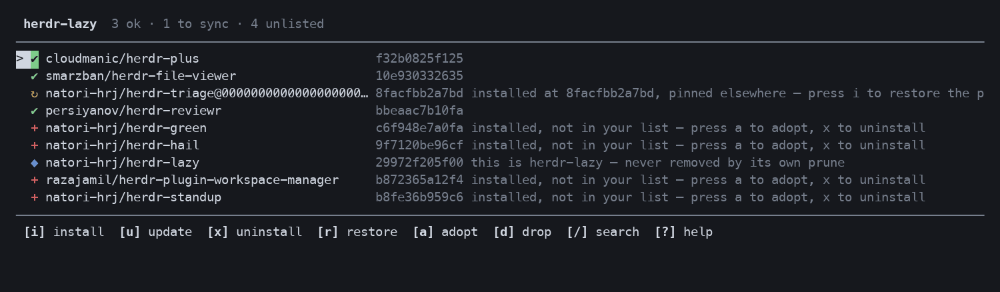

# herdr-lazy

> Be lazy. Declare the plugins you want; let the tool converge your machine to them.

A declarative plugin **manager** and curated **distro** for [herdr](https://herdr.dev).

herdr installs plugins one imperative command at a time. There is no way to declare the
set you want, and no lockfile — so a working setup cannot be reproduced on another
machine. herdr-lazy adds both.



## What it gives you

- **A declarative plugin list.** One `owner/repo` per line. `sync` converges your
  machine to it — installing what is missing, and (with `--prune`) removing the rest.
- **A real lockfile.** Entries pin to a commit, and the lock records the commit herdr
  actually checked out. Copy the lock to another machine, `sync`, and you get the same
  plugins at the same commits.
- **A manage pane.** A herdr overlay pane with the same operations on single keys —
  `i`/`u`/`x`/`r` as in lazy.nvim, lowercase for the selected row and uppercase for the
  whole list. `?` shows the full keymap.
- **Marketplace search, in the pane.** Press `/` to search all published herdr plugins by
  name, description or topic, and add one to your list without leaving the terminal.
- **A curated default set.** `init` writes a starting bundle so a fresh herdr is useful
  immediately.

herdr-lazy is itself a herdr plugin: it drives the herdr CLI (via `HERDR_BIN_PATH`) to
manage the *other* plugins.

## Install

Requires herdr ≥ 0.7.0.

```sh
herdr plugin install natori-hrj/herdr-lazy
```

Install fetches a prebuilt binary and verifies its SHA-256; if none matches your platform,
or anything about the download is not exactly right, it falls back to building from source
with [Rust](https://rustup.rs) (≥ 1.78). No toolchain is needed on the fast path.

**Platform status.** Developed and verified end-to-end on macOS (arm64). Linux binaries are
built and the test suite runs on Linux in CI, but the install has not been exercised on a
real Linux machine. Windows has no prebuilt binary and builds from source; nothing about it
has been tested. If you run either, reports are very welcome — see the open issues.

Then open the manage pane from the command palette (**Lazy: open manage pane**), or
bind it:

```toml
# ~/.config/herdr/config.toml
[[keys.command]]
key = "prefix+shift+l"
type = "plugin_action"
command = "herdr-lazy.manage"
description = "manage plugins"
```

Pick a key that is actually free — `prefix+l` is `focus_pane_right`, and `h`/`j`/`k`/`n`/`p`/
`c`/`g` are taken too. `prefix+?` lists your active bindings.

## Use

```sh
herdr-lazy init          # write the curated default list
herdr-lazy list          # show what the list asks for
herdr-lazy sync          # install what is missing
herdr-lazy update        # move unpinned entries to their latest commit
herdr-lazy sync --prune  # also uninstall anything not in the list
```

`sync` and `update` take plugin names to work on just those:

```sh
herdr-lazy sync cloudmanic/herdr-plus
herdr-lazy update smarzban/herdr-file-viewer
```

| command | what it does |
|---|---|
| `init [--force]` | write the curated default bundle |
| `list` | show the desired plugin set |
| `install [<repo>…]` | install what is missing, restore drifted pins |
| `sync [<repo>…] [--prune]` | the same, plus `--prune` to uninstall what is not listed |
| `update [<repo>…]` | re-resolve unpinned entries to their latest commit |
| `restore [<repo>…]` | put plugins back to the commits in the lockfile |
| `ui` / `manage` | open the manage pane (`/` inside it searches the marketplace) |
| `add <owner/repo>` | add an entry to the bundle |
| `remove <owner/repo>` | remove an entry from the bundle |
| `lock` | write the lockfile from the current bundle |
| `probe` | dump what the herdr CLI exposes (for debugging) |

### Already using herdr?

Nothing has to be reinstalled, and `init` is optional. The pane lists every plugin you
already have, marks the ones your list does not mention, and `a` adopts the highlighted one
into it. Working through that list turns a setup you built by hand into a declared one
without touching the plugins themselves — after which it can be pinned, locked, and
reproduced on another machine.

Both files live in the directory herdr assigns the plugin — `herdr plugin config-dir
herdr-lazy` prints it:

- `plugins.list` — the set you declare, edited by hand or via `add`/`remove`
- `plugins.lock` — the commits actually installed, rewritten on every `sync`

Run from a shell, herdr-lazy asks herdr for that path rather than guessing, so the CLI and
the manage pane always read the same files.

## Finding plugins

herdr publishes its marketplace as a single index, so the pane can search it directly.
Press `/` and type. Enter adds the highlighted plugin to your list, closes the search, and
leaves the cursor on the new entry — so `i` then installs the thing you just chose, and not
whatever row you happened to be on before.

Each result shows its star count and how long ago it was last pushed — `3d`, `2w`, `5mo` —
because whether a plugin is still maintained matters more than how many stars it has.
`ctrl+o` opens the repository, so you can read someone's code before installing it.

Search terms are ANDed and each may match the name, description or topics, so `worktree fzf`
finds a worktree plugin whose description mentions fzf.

Enter adds to your list rather than installing outright: one keystroke on a fuzzy match
should not run a stranger's build script. The list is where intent is recorded.

The index is cached for six hours (`ctrl+r` refreshes) and works offline from that cache,
saying how old it is. Two caveats worth stating plainly: the index endpoint is **not a
documented API** — it is what the marketplace page itself fetches, and it may change without
notice — and everything here fails soft, so if it becomes unreachable, browsing stops working
and nothing else does.

## Pinning and reproducibility

```
owner/repo             # tracks the default branch
owner/repo@v1.2.0      # pinned to a tag
owner/repo@9f3c1ab     # pinned to a commit — reproducible and checkable
```

These map onto herdr's native `plugin install --ref`. `sync` writes the lock from
herdr's own `source.resolved_commit`, so the lock records what is *installed*, not
merely what was requested.

`sync` also **enforces** commit pins: a plugin sitting at the wrong commit is restored,
not silently accepted. Tag and branch pins cannot be checked locally — herdr resolves
them at install time and does not report the original ref back — so those are flagged
as unverifiable rather than reinstalled on every run.

`update` deliberately skips pinned entries. A pin means "this commit"; moving it
silently would make the lock disagree with the list. Edit the list to move a pin.

`restore` is the other direction: it converges to the **lock** rather than the list, so a
lock copied from another machine reproduces that machine directly — no editing the list by
hand. It never rewrites the lock, since here the lock is the input.

```sh
scp other-machine:~/.config/herdr/plugins/config/herdr-lazy/plugins.lock .
cp plugins.lock "$(herdr plugin config-dir herdr-lazy)/"
herdr-lazy restore
```

## Safety

`--prune` uninstalls only what it can prove is extraneous. A match is **strong** when
herdr's `source` names the repo (`owner` + `repo`), and **weak** when only the display
name lines up — herdr's `plugin_id` and `name` bear no reliable relation to the repo
(`cloudmanic/herdr-plus` registers as `cloudmanic.herdr-plus`). Prune acts on strong matches only.
Locally-linked plugins have no owner/repo at all and are always kept: herdr-lazy is
normally one, so this also stops prune from removing the tool running it.

Under-removing is recoverable. Uninstalling the wrong plugin is not.

## The default bundle

A distro is an opinion, so here is the reasoning rather than just the list. Two criteria,
in order: prefer what the ecosystem has already vetted, then fill the gaps nothing else
covers. Overlapping plugins are excluded rather than stacked — two plugins that both open
a file pane is a worse default than one.

| plugin | why |
|---|---|
| [cloudmanic/herdr-plus](https://github.com/cloudmanic/herdr-plus) | projects and quick actions; the broadest general-purpose add-on |
| [smarzban/herdr-file-viewer](https://github.com/smarzban/herdr-file-viewer) | git-aware read-only file pane |
| [persiyanov/herdr-reviewr](https://github.com/persiyanov/herdr-reviewr) | review an agent's diff line by line and send comments back to it |
| [razajamil/herdr-plugin-workspace-manager](https://github.com/razajamil/herdr-plugin-workspace-manager) | per-workspace tab/pane layouts, applied automatically |
| [natori-hrj/herdr-triage](https://github.com/natori-hrj/herdr-triage) | ranks agents by who needs you most |
| [natori-hrj/herdr-green](https://github.com/natori-hrj/herdr-green) | runs a project's tests when its agent finishes |
| [natori-hrj/herdr-standup](https://github.com/natori-hrj/herdr-standup) | digest of what every agent actually changed |

The last three are by this project's author. They are here because running several agents
at once creates a problem the ecosystem does not otherwise address — knowing which one to
look at, whether its work is sound, and what it did — not because of who wrote them. If
that is not your problem, remove them.

A third criterion showed up during testing: it has to actually install. herdr runs plugin
builds with a minimal PATH that excludes `~/.cargo/bin`, so a plugin whose build is a bare
`cargo build --release` fails on machines where Rust is installed and works fine in your own
shell. herdr-lazy itself works around this (see `scripts/fetch-or-build.sh`), but a default
set cannot hand a new user a failed install.

Deliberately **not** included, despite being good:
[herdr-spreader](https://github.com/yuk1ty/herdr-spreader) (41★) is the better-known layout
plugin, but it hits exactly that build problem, and workspace-manager does the same job with
no build step;
[herdr-remote](https://github.com/dcolinmorgan/herdr-remote) and
[collie](https://github.com/AltanS/collie) cover remote approval, where the right choice
depends on where you want to be pinged — not a decision a default set should make for you.

None of this is load-bearing: `init` just writes these lines into `plugins.list`. Edit it,
or skip `init` and build your own with `add`.

## Roadmap

Directions, not promises. Anything with an issue open is specified enough to be worked on;
the rest still needs design.

- **Warn before installing what cannot install.** herdr runs plugin builds with a minimal
  PATH, so a plugin whose build is a bare `cargo build` fails on machines where Rust works
  fine everywhere else. The manifest is readable before install, so the browser could say so.
- **`check`** — show what has updates without applying any, the way `update` does but
  read-only. Needs a plan for GitHub API rate limits.
- **Starter lists** — `init --from owner/repo`, so a curated list can be shared and adopted
  the way people fork a LazyVim starter.
- **enable / disable from the pane** — herdr supports both; herdr-lazy only reports the state.

## Design notes

- **Rust, and nearly dependency-free.** The manager is orchestration — shelling out to
  the herdr CLI — which std covers, including a small hand-written JSON reader for
  `plugin list --json`. The one dependency is `crossterm`, because std cannot put a
  terminal into raw mode and the manage pane needs it. Not ratatui: the UI is a list
  with a status column, and ratatui costs 70 crates against crossterm's 19.
- **Never parse human output.** All state comes from `herdr plugin list --json`.
- **Long operations leave the TUI** rather than being redrawn as in-pane progress, so
  a failing plugin build shows you its actual output.

## License

MIT
