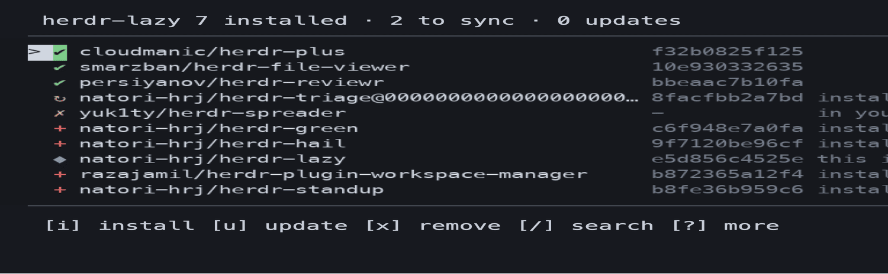

# herdr-lazy

> Be lazy. Declare the plugins you want; let the tool converge your machine to them.

A declarative plugin **manager** and curated **distro** for [herdr](https://herdr.dev).

herdr installs plugins one imperative command at a time. There is no way to declare the
set you want, and no lockfile — so a working setup cannot be reproduced on another
machine.

herdr-lazy replaces that with one file you own. `plugins.list` is a plain list of
`owner/repo` lines: readable, editable by hand, keepable in git, copyable to another
machine. Everything the tool does is a way to reach that file — `init` writes a good
starting one, extras append curated bundles, `add` and `remove` edit it, the manage pane
edits it on single keys — and `sync` makes your machine match it, at the exact commits the
lockfile records.



## What it gives you

- **A declarative plugin list.** `sync` converges your machine to it — installing what is
  missing, and (with `--prune`) removing the rest.
- **A real lockfile.** Entries pin to a commit, and the lock records the commit herdr
  actually checked out. Copy the lock to another machine, `sync`, and you get the same
  plugins at the same commits.
- **A hint when something has moved.** `↑` marks a plugin whose repository has been pushed
  to since you installed it, so `u` is worth pressing.
- **A manage pane.** A herdr overlay pane with the same operations on single keys —
  `i`/`u`/`x`/`r` as in lazy.nvim. Tick rows with space or a click to act on several at
  once, or act on just the row under the cursor when nothing is ticked. `?` shows the full
  keymap; the mouse scrolls and ticks.
- **A list that tells you what each plugin is.** Every installed row shows its own one-line
  description, so you can tell what you have and spot two plugins that do the same thing
  without opening each one.
- **A way to find out what you just installed.** Press `l` on any plugin to see what it
  does, which actions it offers, which panes it can open, and what makes it run on its own
  — then run an action right there.
- **Marketplace search, in the pane.** Press `/` to search all published herdr plugins by
  name, description or topic, and add one to your list without leaving the terminal.
- **A curated default set.** `init` writes a starting bundle so a fresh herdr is useful
  immediately, and `e` in the pane opens the opt-in extras on top of it.
- **A first run that leaves you working.** On a machine with nothing set up, the first herdr
  start after installing writes the list, installs it, and binds a key to the pane — rather
  than handing you an empty manager with no door.

herdr-lazy is itself a herdr plugin: it drives the herdr CLI (via `HERDR_BIN_PATH`) to
manage the *other* plugins.

## Install

Requires herdr ≥ 0.7.5, which is where the `[[startup]]` hook the first run depends on
arrives. Earlier versions used to install this and then quietly do nothing.

```sh
herdr plugin install natori-hrj/herdr-lazy
```

Install fetches a prebuilt binary and verifies its SHA-256; if none matches your platform,
or anything about the download is not exactly right, it falls back to building from source
with [Rust](https://rustup.rs) (≥ 1.78). No toolchain is needed on the fast path.

**Platform status.** Developed and verified end-to-end on macOS (arm64). Linux binaries are
built and the test suite runs on Linux in CI, but the install has not been exercised on a
real Linux machine. Windows has no prebuilt binary and builds from source, and needs a Rust
toolchain for that reason; the install, `probe`, and opening the manage pane have been
verified on Windows 11 with herdr 0.7.5-preview in Windows Terminal (ConPTY), but the pane's
keymap and a real `sync --prune` have not been exercised there. If you run Linux or Windows,
reports are very welcome — see the open issues.

**The first herdr start after installing sets the machine up** (a `[[startup]]` hook): it
writes the curated list, installs what the list names, and binds `prefix+shift+l` to the
manage pane. It prints everything it did. Press the key and you are in.

That happens only on a machine that has plainly never been set up — no plugin list, and
nothing installed but herdr-lazy itself. If you already have plugins, or already have a list,
nothing is written and nothing is installed; see [Already using herdr?](#already-using-herdr)
for adopting what you have. It never runs twice, and it will not take `prefix+shift+l` if
something else is already bound to it. `HERDR_LAZY_NO_BOOTSTRAP=1` turns it off entirely.

To bind the pane yourself, or to a different key:

```toml
# ~/.config/herdr/config.toml
[[keys.command]]
key = "prefix+shift+l"
type = "plugin_action"
command = "herdr-lazy.manage"
description = "manage plugins"
```

Pick a key that is actually free — `prefix+l` is `focus_pane_right`, and `h`/`j`/`k`/`n`/`p`/
`c`/`g` are taken too. `prefix+?` lists your active bindings.

**On Windows** the config lives at `%APPDATA%\herdr\config.toml`, and the action to bind is
`herdr-lazy.manage-windows`. herdr rejects duplicate action ids even when they are gated to
platforms that cannot overlap, so the Windows entry needs its own id. Binding the plain
`herdr-lazy.manage` there is accepted by the config parser and then refused at the keypress,
where nobody sees it — so it reads as a key that does nothing. The first-run bootstrap binds
whichever id herdr reports for the platform it is running on, which is the main reason not to
write this by hand.

herdr has no command palette, so without a binding the only way in is the CLI:

```sh
herdr plugin pane open --plugin herdr-lazy --entrypoint manage --focus
```

On Windows that entrypoint is `manage-windows`, for the same reason.

## Use

Everything below is also in the manage pane, which is the normal way to use this: open it and
press `?` for the keymap. The CLI exists for scripting and for things you would rather not do
interactively.

**`herdr-lazy` is not on your PATH.** It lives inside herdr's plugin directory, whose name
contains an install-specific hash, so there is nothing sensible to symlink. If you want it in
a shell, add this to your shell config:

```sh
herdr-lazy() {
  local root
  root=$(herdr plugin list --json | python3 -c \
    "import json,sys;print([p['plugin_root'] for p in json.load(sys.stdin)['result']['plugins'] if p['plugin_id']=='herdr-lazy'][0])")
  "$root/target/release/herdr-lazy" "$@"
}
```

```sh
herdr-lazy init          # write the curated default list
herdr-lazy list          # show what the list asks for
herdr-lazy sync          # install what is missing
herdr-lazy update        # move unpinned entries to their latest commit
herdr-lazy sync --prune  # also uninstall anything not in the list

herdr-lazy extras                    # list the opt-in extras
herdr-lazy init --extras worktrunk   # defaults plus a chosen extra
herdr-lazy init --from owner/repo    # start from someone else's list instead
```

`sync` and `update` take plugin names to work on just those:

```sh
herdr-lazy sync cloudmanic/herdr-plus
herdr-lazy update smarzban/herdr-file-viewer
```

| command | what it does |
|---|---|
| `init [--force] [--extras <id,…>] [--from <owner/repo[@ref]>] [--dry-run]` | write the curated default bundle, or adopt someone else's list; `--dry-run` prints it instead |
| `extras` | list the opt-in extras (`e` in the pane picks them interactively) |
| `list` | show the desired plugin set |
| `install [<repo>…]` | install what is missing, restore drifted pins |
| `sync [<repo>…] [--prune]` | the same, plus `--prune` to uninstall what is not listed |
| `update [<repo>…]` | re-resolve unpinned entries to their latest commit |
| `restore [<repo>…]` | put plugins back to the commits in the lockfile |
| `ui` / `manage` | open the manage pane (`/` inside it searches the marketplace) |
| `add <owner/repo>` | add an entry to the bundle |
| `remove <owner/repo>` | remove an entry from the bundle |
| `lock` | write the lockfile from the current bundle |
| `auto-sync [on\|off]` | install missing plugins automatically when herdr starts |
| `probe [--raw]` | check the herdr bridge and show the resolved paths; `--raw` adds the full payloads |

### Already using herdr?

Nothing has to be reinstalled, and `init` is optional. The pane lists every plugin you
already have, marks the ones your list does not mention, and `a` adopts the highlighted one
into it. Working through that list turns a setup you built by hand into a declared one
without touching the plugins themselves — after which it can be pinned, locked, and
reproduced on another machine.

Both files live in the directory herdr assigns the plugin — `herdr plugin config-dir
herdr-lazy` prints it:

- `plugins.list` — the set you declare, edited by hand or via `add`/`remove`
- `plugins.lock` — the commits actually installed, rewritten on every `sync`

Run from a shell, herdr-lazy asks herdr for that path rather than guessing, so the CLI and
the manage pane always read the same files.

## What did I just install?

Installing a curated set hands you plugins you did not pick one by one. Press `l` on any row
to see what one actually does — herdr's own manifest already knows, so this is not a
description someone had to remember to write:

```
 cloudmanic/herdr-plus
 ─────────────────────────────────────────────────────────────────────────────
 An extension for herdr — a collection of tools that make it better. Projects:
 fuzzy-pick a declarative template to spin up a whole workspace…

 things you can run  (enter runs the highlighted one)
 >  Herdr Plus: Projects                     projects
    Herdr Plus: Quick Actions                quick-actions

 panes it can open
    Herdr Plus: Projects    zoomed · herdr plugin pane open --plugin … --entrypoint picker

 runs by itself on  worktree.created, worktree.opened

 bind one to a key:  [[keys.command]] type = "plugin_action" command = "…"
```

Enter runs the highlighted entry — an action, or a pane it opens — so you can try something
without first working out how to reach it.

### Binding it to a key

herdr has no command palette, and a plugin manifest cannot suggest a keybinding. Until an
action is written into `config.toml` by hand there is no way to reach it, and nothing tells
you it exists in the first place.

Press `b`, then a letter: the entry gets bound to `prefix+shift+<letter>`. Shift is not
optional — herdr's own defaults live on `prefix+<letter>` and are not exposed by the CLI, so
staying out of that range is the only way to be sure nothing is shadowed.

Panes can be bound too. herdr has a binding type for actions (`plugin_action`) but none for
opening a pane, so those are written as `type = "shell"` running `herdr plugin pane open`.
This matters more than it sounds: several plugins expose only a pane, and without it `b`
would do nothing for them.

Before writing anything, the pane shows the exact lines and the file they go into:

```
 This appends to /Users/you/.config/herdr/config.toml:

   # added by herdr-lazy
   [[keys.command]]
   key = "prefix+shift+z"
   type = "shell"
   command = "herdr plugin pane open --plugin triage --entrypoint list"

 [y] write it   [n / esc] cancel
```

That confirmation is not a formality. The pane is launched by herdr, so an environment
variable set in your shell never reaches it — there is no way to point this at a scratch file
and try it safely. Your config is copied to `config.toml.herdr-lazy-backup` before the first
write, every added block is marked `# added by herdr-lazy`, and a key that is already bound
is refused rather than shadowed.

## Spotting updates

`↑` beside a commit means the plugin's repository has been pushed to since that copy was
installed, and the header counts how many. `u` updates them.

It is a hint, and worded as one. The comparison is between the marketplace index's
`pushedAt` and when herdr fetched the plugin, so a push to any branch counts even if the
default branch — the thing that actually gets installed — has not moved. Erring toward
reporting is deliberate: a needless `u` costs a moment, while a missed update stays missed.

Pinned entries are never marked. A pin means "this commit, deliberately", and flagging it
would teach you to ignore the marker.

This costs no network access. It reads the marketplace index that browsing already cached;
with nothing cached, the column is simply absent.

## Acting on several at once

Space ticks the row under the cursor; press it again to untick. A click does the same. Then
`i`, `u`, `x`, `r` and `a` apply to everything ticked.

With nothing ticked they apply to the row under the cursor, so this changes nothing for
anyone who never touches a checkbox. `esc` clears the selection.

A click only ever ticks — nothing installs or uninstalls until you press a key for it.

## Finding plugins

herdr publishes its marketplace as a single index, so the pane can search it directly.
Press `/` and type. Enter adds the highlighted plugin to your list, closes the search, and
leaves the cursor on the new entry — so `i` then installs the thing you just chose, and not
whatever row you happened to be on before.

Each result shows its star count and how long ago it was last pushed — `3d`, `2w`, `5mo` —
because whether a plugin is still maintained matters more than how many stars it has.
`ctrl+o` opens the repository, so you can read someone's code before installing it.

Search terms are ANDed and each may match the name, description or topics, so `worktree fzf`
finds a worktree plugin whose description mentions fzf.

`tab` narrows to a category — worktree, notifications, agents, and so on — for when you want
to see what exists rather than search for something you can already name. It cycles back to
`all`, and works alongside the query. Categories come from keywords matched against the name,
description and topics, because GitHub topics alone miss more than half the plugins; anything
that matches nothing lands in `other` rather than disappearing.

Enter adds to your list rather than installing outright: one keystroke on a fuzzy match
should not run a stranger's build script. The list is where intent is recorded.

Adding one also reads its manifest and says so if it cannot install here. herdr runs plugin
builds with a minimal PATH that excludes `~/.cargo/bin`, so a plugin whose build is a bare
`cargo build --release` fails even on machines where Rust works perfectly in your own shell —
the failure then reads as a broken toolchain, which it is not. The check only fires on that
shape and stays quiet on anything it cannot read confidently: sending you away from a plugin
that works would be worse than saying nothing. It never blocks the add.

The index is cached for six hours (`ctrl+r` refreshes) and works offline from that cache,
saying how old it is. Two caveats worth stating plainly: the index endpoint is **not a
documented API** — it is what the marketplace page itself fetches, and it may change without
notice — and everything here fails soft, so if it becomes unreachable, browsing stops working
and nothing else does.

## Pinning and reproducibility

```
owner/repo             # tracks the default branch
owner/repo@v1.2.0      # pinned to a tag
owner/repo@9f3c1ab     # pinned to a commit — reproducible and checkable
```

These map onto herdr's native `plugin install --ref`. `sync` writes the lock from
herdr's own `source.resolved_commit`, so the lock records what is *installed*, not
merely what was requested.

`sync` also **enforces** commit pins: a plugin sitting at the wrong commit is restored,
not silently accepted. Tag and branch pins cannot be checked locally — herdr resolves
them at install time and does not report the original ref back — so those are flagged
as unverifiable rather than reinstalled on every run.

`update` deliberately skips pinned entries. A pin means "this commit"; moving it
silently would make the lock disagree with the list. Edit the list to move a pin.

`restore` is the other direction: it converges to the **lock** rather than the list, so a
lock copied from another machine reproduces that machine directly — no editing the list by
hand. It never rewrites the lock, since here the lock is the input.

```sh
scp other-machine:~/.config/herdr/plugins/config/herdr-lazy/plugins.lock .
cp plugins.lock "$(herdr plugin config-dir herdr-lazy)/"
herdr-lazy restore
```

## Keeping in sync automatically

Press `A` in the manage pane. herdr-lazy then installs anything on your list that is missing
whenever herdr starts (the same `[[startup]]` hook the first run uses) — open herdr on a new machine with
a list already in place and your plugins appear on their own. The header shows `auto-sync on`
while it is active.

It is off by default, and deliberately narrow:

- **Off unless you turn it on** — a plugin that installs other software at startup should not
  do so by surprise. The one exception is the first run on a fresh machine, which is what
  installing a distro asks for; every start after that is silent until you turn this on.
- **Installs only** — it never prunes and never moves a pinned commit. Startup completes a
  setup that is missing things; it does not change one that is working. Use `sync` for that.
- **Silent when there is nothing to do** — which is almost always, so a normal `herdr` launch
  is unaffected.

## Safety

`--prune` uninstalls only what it can prove is extraneous. A match is **strong** when
herdr's `source` names the repo (`owner` + `repo`), and **weak** when only the display
name lines up — herdr's `plugin_id` and `name` bear no reliable relation to the repo
(`cloudmanic/herdr-plus` registers as `cloudmanic.herdr-plus`). Prune acts on strong matches only.
Locally-linked plugins have no owner/repo at all and are always kept: herdr-lazy is
normally one, so this also stops prune from removing the tool running it.

Under-removing is recoverable. Uninstalling the wrong plugin is not.

## Managing your list with dotfiles

Your `plugins.list` is the whole declaration — one `owner/repo` per line — and `plugins.lock`
is the exact commits it resolved to. Both are plain text, both belong in a dotfiles repo, and
together they are all another machine needs.

Point herdr-lazy at a file in your repo with `HERDR_LAZY_LIST`:

```sh
# in your shell profile, or a herdr-lazy env
export HERDR_LAZY_LIST="$HOME/dotfiles/herdr/plugins.list"
```

The lock is written next to it (`plugins.lock`), so both live in your repo. The marketplace
cache is kept out of the way in `$XDG_CACHE_HOME/herdr-lazy/` (or `~/.cache/herdr-lazy/`), so
nothing you did not choose ends up staged.

On a new machine:

```sh
git clone …/dotfiles && export HERDR_LAZY_LIST="$HOME/dotfiles/herdr/plugins.list"
herdr-lazy restore     # the exact commits from plugins.lock
# or: herdr-lazy sync   # the latest of whatever the list asks for
```

`restore` reproduces the lock commit-for-commit; `sync` installs the latest each entry
resolves to. Commit both files after a change and the next machine is one command behind.

### Nix

herdr's own flake packages the CLI; plugins are herdr-lazy's job, not the flake's. There is no
home-manager module yet — if that is something you would use, open an issue. In the meantime a
Nix user can generate `plugins.list` from their config and set `HERDR_LAZY_LIST` to it, which
keeps the plugin set declarative without herdr-lazy needing to know about Nix at all. Note that
`auto-sync` installs on herdr startup, a side effect a purist may want off (it is off by
default); `restore` in an activation script is the more Nix-shaped fit.

## The default bundle

A distro is an opinion, so here is the reasoning rather than just the list. Two criteria,
in order: prefer what the ecosystem has already vetted, then fill the gaps nothing else
covers. Overlapping plugins are excluded rather than stacked — two plugins that both open
a file pane is a worse default than one.

| plugin | why |
|---|---|
| [natori-hrj/herdr-lazy](https://github.com/natori-hrj/herdr-lazy) | this tool, listed so that `u` can update it like anything else |
| [cloudmanic/herdr-plus](https://github.com/cloudmanic/herdr-plus) | projects and quick actions; the broadest general-purpose add-on |
| [smarzban/herdr-file-viewer](https://github.com/smarzban/herdr-file-viewer) | git-aware read-only file pane |
| [persiyanov/herdr-reviewr](https://github.com/persiyanov/herdr-reviewr) | review an agent's diff line by line and send comments back to it |
| [razajamil/herdr-plugin-workspace-manager](https://github.com/razajamil/herdr-plugin-workspace-manager) | per-workspace tab/pane layouts, applied automatically |

The first entry is this tool. `update` and the pane's `u` only act on what your list names, so
leaving it out made herdr-lazy the one plugin herdr-lazy could not update. Removing it from the
list does not endanger it: `--prune` refuses to uninstall it by identity, not by membership.

There is one more criterion, and it outranks the rest: somebody has to actually use these.
Popularity is evidence of that, not a substitute — an earlier version of this set kept a plugin
on three stars that its own author never ran. The author's own plugins clear that bar or leave,
exactly as anyone else's do.

A third criterion showed up during testing: it has to actually install. herdr runs plugin
builds with a minimal PATH that excludes `~/.cargo/bin`, so a plugin whose build is a bare
`cargo build --release` fails on machines where Rust is installed and works fine in your own
shell. herdr-lazy itself works around this (see `scripts/fetch-or-build.sh`), but a default
set cannot hand a new user a failed install.

Deliberately **not** included, despite being good:
[herdr-spreader](https://github.com/yuk1ty/herdr-spreader) (41★) is the better-known layout
plugin, but it hits exactly that build problem, and workspace-manager does the same job with
no build step;
[herdr-remote](https://github.com/dcolinmorgan/herdr-remote) and
[collie](https://github.com/AltanS/collie) cover remote approval, where the right choice
depends on where you want to be pinged — not a decision a default set should make for you.

None of this is load-bearing: `init` just writes these lines into `plugins.list`. Edit it,
or skip `init` and build your own with `add`.

## Starting from someone else's list

```sh
herdr-lazy init --from owner/repo        # their plugins.list becomes yours
herdr-lazy init --from owner/repo@v1     # at a ref, if you would rather it not move
```

A real one, if you want somewhere to start:

```sh
herdr-lazy init --from natori-hrj/herdr-config
```

That is this project author's own list — the five plugins actually in use, which is also why
they are the ones in the default set. Publishing yours is a repository with a `plugins.list` at
the root and nothing else required.

Press `f` in the pane to read one before taking it. Each entry becomes a row, marked with what
your machine already says about it — in your list, installed but unlisted, or new — and space
ticks the ones you want. Everything you do not already have starts ticked, so enter takes "the
rest of theirs" without touching a row. Three of someone's five is a flag away from impossible
and a keystroke away in the pane.

On the command line, `--dry-run` prints what would be written and writes nothing:

```sh
herdr-lazy init --from owner/repo --dry-run
```

`init --from` reads `plugins.list` from the root of that repository and writes it as your list,
comments and all. After that it is your file: there is no upstream, no link back, and nothing to update
from. A fork, not a subscription — the whole point is that you can now disagree with it.

The lockfile does not come with it. Their list means the same plugins; their lock would mean
the same commits, which is a much stronger thing to accept from a stranger.

Nothing is installed by this, as with any `init` — you get a list to read first, and `sync`
when you agree with it. It refuses to overwrite an existing list without `--force`, and it
refuses anything that does not look like a plugin list rather than writing it over yours.

## Extras

The default bundle stays out of choices that depend on you — which worktree tool, which
notifier. Extras are how you opt into those.

Press `e` in the pane for the menu: space ticks the ones you want, enter adds them to your
list, and they come back ticked in the list itself so `i` installs exactly those. A `✔` marks
an extra you already have. Nothing is installed by the picker — adding to the list is still a
separate step from running someone's build.

The same menu, from a shell:

```sh
herdr-lazy extras                    # see what is on offer, grouped by category
herdr-lazy init --extras worktrunk   # curated defaults, plus the worktrunk workflow
```

An extra is one coherent capability, not a category dump. Where two plugins do the same job
they are two extras you choose between — `--extras` never stacks them, the same way the
default set swaps rather than adds. Each extra's description names any external setup it needs
(a CLI to install, a service to configure) so opting in is an informed choice.

### Extras of your own

An extra is a `.list` file with two comment lines, which is a format you can write by hand.
Drop one in `extras/` beside your plugin list and it joins the menu — no pull request, nothing
to convince anyone of:

```
# category: mine
# the three things I install on every machine
cloudmanic/herdr-plus
smarzban/herdr-file-viewer
```

Saved as `extras/mine.list`, that is `herdr-lazy init --extras mine`, and a row marked `*` in
the pane. It sits beside the list rather than in a config directory for the reason the lockfile
does: if you keep your list in a dotfiles repo, the things you wrote belong there too. Giving
one the same name as a bundled extra replaces it, and the listing says so. A file that lists no
plugins is reported and skipped, never a crash and never a silent disappearance.

Extras are plain `owner/repo` lists under [`extras/`](extras/), embedded at build time, so
listing one never touches the network. Adding an extra is a small, reviewed pull request —
drop a file in `extras/` and add a line to the registry. The bar it clears is in
[CONTRIBUTING.md](CONTRIBUTING.md#adding-a-plugin-to-the-extras), and it is the same bar for a
contributor's plugin and the author's.

## Roadmap

Directions, not promises. Anything with an issue open is specified enough to be worked on;
the rest still needs design.

- **Warn before installing what cannot install.** herdr runs plugin builds with a minimal
  PATH, so a plugin whose build is a bare `cargo build` fails on machines where Rust works
  fine everywhere else. The manifest is readable before install, so the browser could say so.
- **`check`** — show what has updates without applying any, the way `update` does but
  read-only. Needs a plan for GitHub API rate limits.
- **enable / disable from the pane** — herdr supports both; herdr-lazy only reports the state.

## Design notes

- **Rust, and nearly dependency-free.** The manager is orchestration — shelling out to
  the herdr CLI — which std covers, including a small hand-written JSON reader for
  `plugin list --json`. The one dependency is `crossterm`, because std cannot put a
  terminal into raw mode and the manage pane needs it. Not ratatui: the UI is a list
  with a status column, and ratatui costs 70 crates against crossterm's 19.
- **Never parse human output.** All state comes from `herdr plugin list --json`.
- **Long operations leave the TUI** rather than being redrawn as in-pane progress, so
  a failing plugin build shows you its actual output.

## License

MIT
